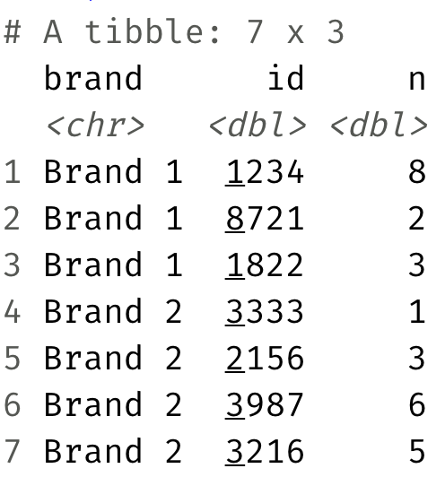

# Nobel - Reading and writing csv file

```{r load-packages-nobel, message=FALSE}
library(tidyverse)
```

In this worksheet we are going to use contains information about recipients of the Nobel Prize. The data contained within the file called `nobel.csv` from the `data/` folder. Open the file to see how the data has been saved.

Now, let's first load the data. (Note, set `eval = TRUE` when you have written your code)

```{r label-me1, eval=FALSE}
nobel <- ___(___)
```

Then let's split the data into two based on whether the _category_ variable is or is not a STEM subject:

```{r label-me2, eval=FALSE}
# stem laureates
___ <- nobel %>%
  filter(___)

# non-steam laureates
___ <- nobel %>%
  filter(___)
```

And finally write out each data frame to the `data/` folder with an informative filename:

```{r label-me3}
# add code for writing out the two data frames here
```


-----------------------


# Sales - Reading Excel file

```{r load-packages-sales, message=FALSE}
library(tidyverse)
library(readxl)
```

* Read in the Excel file called `sales.xlsx` from the `data/` folder 
such that it looks like the following.

```{r echo=FALSE}
knitr::include_graphics("images/sales-1.png")
```

```{r label-me4}
# Write your code here

```

* **Stretch goal:** Manipulate the sales data such such that it looks like the 
following.

```{r echo=FALSE}

```

```{r label-me5}
# Write your code here

```


